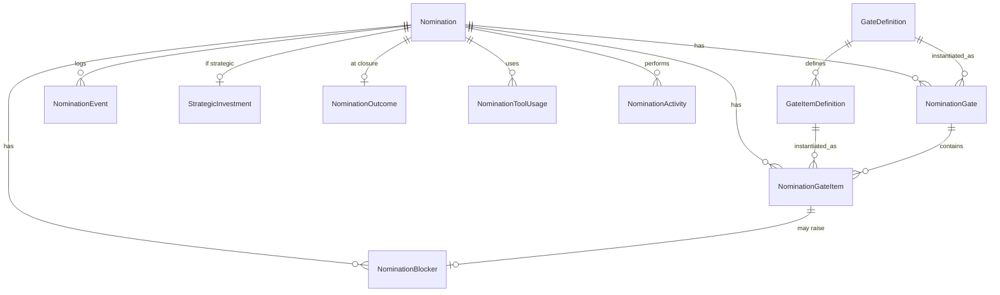

# Factory Operating System — Design & Delivery Plan

Evolves the CAF Operations Portal from a **Nomination Tracker** into a **Factory Operating System (FOS)**:
a gated, SA-owned governance model that guides delivery, tells truthful velocity/SLA, tracks GHCP
adoption, and governs strategic pilots.

> Source material: `data/study/ANALYSIS.md` (FDO scorecard), `data/study/app-factory.md` (GHCP readiness/
> usage), `Strategic pilots.md` (pilot governance), `design-guidelines-case-studies.md` (Factory OS +
> **SA Accountability Model**). This document is the consolidated build blueprint.

---

## 1. Purpose & scope

Today the portal answers *"where is each nomination?"* It does **not** answer the questions leadership
and SAs actually ask:

- *What must the SA do next, and what's pending?* (a **guide**, not a report)
- *Are we slow, or are we waiting on the customer / deliberately investing in a pilot?* (**truthful velocity**)
- *Is this migration set up to succeed?* (**readiness governance**)
- *Where is AI (GHCP) actually delivering value?* (**adoption**)

The FOS adds four governance pillars on top of the existing tracker:

1. **Gated SA Accountability** — 8 SA-owned gates with checklists + exit criteria (the *guide*).
2. **Blocker & SLA governance** — structured blockers with a **clock-stopped** concept → honest velocity.
3. **Strategic-pilot governance** — classification + investment register + time thresholds.
4. **GHCP adoption** — readiness, tool/activity usage, adoption maturity 0–7.

---

## 2. Design principles

1. **The SA Accountability Model *is* the schema.** 8 gates × checklist items is the backbone; everything
   (readiness, deliverables, approvals) is a checklist item of a gate.
2. **Guide before report.** Every screen a SA touches must first tell them *what's done / what's pending /
   what's next*. Reporting is a by-product.
3. **The process lives in child tables**, never flat columns. A nomination has a *history* of blockers, a
   *set* of gate items — all time-phased, all `UpdatedBy`/`UpdatedUtc`, all portal-owned.
4. **Truthful metrics.** SLA/velocity accrue only while a nomination is **Active** (clock not stopped) and
   **Classification = Standard**.
5. **Templates in Configuration.** Gates, items, weights, blocker categories, tools, activities,
   classifications are editable vocab — tune governance without a release.
6. **Preserve on FDO import.** All FOS data is portal-owned and survives every FDO drop (like today's
   `BlockedReason`, `WaveLinks`).
7. **Adoption is the risk, not storage.** The gate-checklist UX makes or breaks this — design the SA guide
   screen first and validate it before building the full table set.
8. **Additive, not a rewrite.** FDO 4-stage model stays the SLA system-of-record; the 8 gates sit beneath
   it as governance detail.

---

## 3. Core model

### 3.1 Three orthogonal axes on every nomination
| Axis | Question | Values | Drives |
|------|----------|--------|--------|
| **Execution stage** (exists) | Where in the journey? | FDO 1–4 (SLA of record) with 8 governance gates beneath | progress |
| **Progress state** | Is the clock running, and if not why? | Active · Waiting-on-{…} (clock-stopped) · Blocked · Strategic-Investment | truthful velocity/SLA |
| **Classification** | Which operating model / KPI rules apply? | Standard · Strategic Pilot · Lighthouse · Innovation/POC · Recovery | which denominator |

### 3.2 The gate state machine (SA Accountability Model)
A nomination advances through **8 gates**. Each gate has checklist **items** + **exit criteria** and a
status: `NotStarted → InProgress → Green` (or `Blocked`). Advance is **soft-gated** (v1): the portal warns
and scores compliance rather than hard-blocking, to protect adoption.

```
Discovery → Prerequisites → Assessment → Scope → Architecture → Delivery-Ready → Delivery → Closure
   G1           G2             G3          G4        G5             G6            G7         G8
```

Abnormal transitions are first-class: **reopen** (a completed nomination revisits a gate → new
`NominationGate` cycle), **blocked/waiting** (gate frozen, clock may stop), **scope expansion**
(event + flag), **withdraw/decline/defer** (settled).

### 3.3 Clock-aware velocity/SLA
```
effective age in gate = Σ(active intervals) − Σ(clock-stopped blocker intervals)
velocity / SLA counted only when Classification = Standard
```
This is the single change that lets leadership prove *"30% of Java capacity is strategic investment,
not slow execution."*

### 3.5 Roles (RACI) — SA manages, execution team delivers
Delivery work is done by engineers, but the **SA owns the governance record**. Every gate item carries a
**ResponsibleRole** (who does it) while the **SA is Accountable** (keeps the tracker current, ensures the
gate goes green, escalates blockers).

| Role | On a nomination | RACI |
|------|-----------------|------|
| **SA** | Owns all 8 gates + the checklist; keeps status truthful; raises/resolves blockers | **A** (accountable) |
| **Engineer / Execution team** | Performs technical delivery items (upgrade, containerize, IaC, pipelines, migrate) | **R** (responsible) |
| **PM** | Coordination, customer scheduling | **C** |
| **CFTL** | Gate approvals, extension justification | **A/Approver** at gates |
| **Customer** | Approvals, access, testing sign-off | **R** for customer-owned items |

So the delivery-execution stages (journey 8–12) appear as **G7 checklist items the SA tracks**, even though
engineers execute them — giving the SA a live view of delivery progress (and feeding MSI · Delivery Progress).

### 3.4 Migration Readiness Compliance %
Weighted gate-completion score (from the SA model), a per-nomination, per-SA, and per-region KPI:

| Gate | Weight |
|------|--------|
| Discovery | 10% |
| Prerequisites | 15% |
| Assessment | 15% |
| **Scope Governance** | **20%** |
| TAD / Architecture | 10% |
| Status & FDO hygiene (Delivery-Ready + Delivery) | 15% |
| Risk management (cross-cutting) | 10% |
| Closure | 5% |

---

## 4. Data model

All tables are **portal-owned** and preserved across FDO imports. New tables are children of
`Nomination` (the aggregate root).



### 4.1 Configuration/template tables
- **GateDefinition** — `Id, Key, Name, Order, Weight, OwnerRole (SA), Active`.
- **GateItemDefinition** — `Id, GateId, Key, Label, Kind (Task|Prerequisite|Deliverable|Approval|Signoff),
  SubStage (journey group — e.g. Modernization/Containerization/IaC/CI-CD/Execution), ResponsibleRole
  (SA|Engineer|PM|Customer), Mandatory, Order, Active`. *(SA is always **Accountable**; ResponsibleRole is
  who **does** the work.)*

### 4.2 Per-nomination tables
- **NominationGate** — `Id, NominationId, GateId, Status (NotStarted|InProgress|Green|Blocked),
  EnteredUtc, GreenUtc, UpdatedBy, UpdatedUtc`.
- **NominationGateItem** — `Id, NominationId, GateId, ItemDefId, Status (Pending|Done|NA), Owner,
  CompletedUtc, Ref (doc link), Notes, UpdatedBy, UpdatedUtc`. **← the "what's done / pending" heart.**
- **NominationBlocker** — `Id, NominationId, GateItemId?, Category (vocab), ClockStopped (bool), Owner,
  BlockedSinceUtc, ExpectedResolutionUtc, ResolvedUtc, Notes`.
- **NominationEvent** — `Id, NominationId, GateId?, Type, Field, OldValue, NewValue, ByUser, AtUtc`.
- **StrategicInvestment** (1:1, sparse) — `NominationId, StrategicObjective, DedicatedResources,
  FuturePipelinePotential, UnlockCondition, VelocityImpact (Low|Medium|High|Critical),
  DurationBeyondStandardDays, OpportunityCost, ExpectedRoi`.
- **NominationOutcome** (1:1) — `NominationId, HoursSaved, EffortReductionPct, AcrInfluenced,
  DefectsPrevented, SlaCompliancePct, Csat`.
- **NominationToolUsage** — `Id, NominationId, Tool (vocab), GateId?, FirstUsedUtc`.
- **NominationActivity** — `Id, NominationId, Activity (vocab), GateId?, Status, CompletedUtc`.

### 4.3 New / confirmed scalar fields on `Nomination`
**New:** `Classification (vocab)`, `GhcpAdoptionLevel (0–7)`, `MsxOpportunityId`, `FdoLink`,
`OfferingType (Rehost|Replatform|Refactor)`. **Already present:** Wave links, TPID, `TotalAcr/NnrAcr`,
`Segment`, `Account.StrategicFlag`. **Derived (not stored):** `CurrentGate`, `ReadinessCompliancePct`,
`EffectiveStageAgeDays`.

### 4.4 New vocabularies (Configuration)
Blocker categories · Tool names (extends existing) · Activity types · Deliverable types ·
Classifications · Readiness/Prerequisite items (via GateItemDefinition).

---

## 5. Gate template (seeded, editable)

| Gate | Kind of items (checklist) | Exit criteria |
|------|---------------------------|---------------|
| **G1 Discovery & Readiness** | Customer discovery sessions · App inventory validated · Dependencies identified · Hosting architecture understood · DB/storage/network/identity deps captured · Risks & assumptions documented · Missing info followed up | Discovery complete · Dependency map available · Risks captured · Readiness status updated |
| **G2 Prerequisites** | Subscription readiness · Landing zone · Network connectivity · Firewall approvals · Access onboarding · Service principal · AKS/App Service/VM prereqs · Database readiness · CI/CD readiness | Prerequisite tracker complete · Owners identified · Customer deps tracked · Open blockers visible |
| **G3 Assessment** | AppCAT/Azure Migrate assessment · Migration approach finalized · Modernization opportunities · Complexity validated · Effort sizing · Technical risks documented | Assessment report complete · Migration strategy approved · Risk register available |
| **G4 Scope Governance** ⚑ | Scope document created · In-scope defined · Out-of-scope defined · Customer responsibilities · Factory responsibilities · Assumptions · Dependencies · Acceptance criteria | **Signed scope document** · No ownership ambiguity · FDO updated |
| **G5 Architecture** | TAD prepared · Architecture reviewed · Target-state approved · Security review · Customer signoff | TAD approved · Customer approval · Architecture risks closed |
| **G6 Delivery Readiness** | Scope frozen · Access available · Environments ready · Deployment methodology agreed · Rollback strategy · Customer contacts identified · **Target platform selected** (App Service/AKS/ACA/ARO/VM) | Engineering-ready status |
| **G7 Delivery Governance** *(SA-tracked, engineer-executed; grouped by delivery sub-stage)* | **Modernization:** Version Upgrade · Code Remediation · Dependency Upgrade · Security Fixes · **Containerization:** Dockerfile · Container Image · Registry Push · **IaC:** Bicep · Terraform · Helm · AKS Manifests · **CI/CD:** Build Pipeline · Release Pipeline · Deployment Validation · **Deployment:** Migrate to target · Smoke validation · **Governance:** Weekly status · FDO hygiene · Escalations | Progress reflected in systems · Issues escalated in time |
| **G8 Closure** | UAT completed · Signoff obtained · Documentation delivered · KT completed · Closure report submitted | Customer signoff · FDO closure · Lessons learned captured |

⚑ = highest-weight gate; the doc flags Scope Governance as *"where many nominations fail."*

---

## 6. Feature / page catalog

| # | Page / Feature | Route | Purpose | Primary user |
|---|----------------|-------|---------|--------------|
| F1 | **Nomination Workspace (SA Guide)** | `/nominations/:id` (Governance tab) | Gated checklist — what's done/pending/next; update items; raise/resolve blockers; advance gate | SA |
| F2 | **Governance Board** (Blockers & SLA) | `/governance` | Open blockers by category/owner/aging; clock-stopped; real SLA breaches | Leads / CFTL |
| F3 | **Strategic Investment Register** | `/strategic` | Pilots & strategic accounts; velocity impact; dedicated resources; time-threshold (60/90/120) status; exit criteria | Leadership |
| F4 | **GHCP Adoption** | `/adoption` | License/readiness; adoption level 0–7 distribution; tool-usage trend; activities; by region | Leadership |
| F5 | **Readiness Compliance scorecard** | `/compliance` (or Exec tab) | Weighted compliance % by nomination / SA / region | Leadership |
| F6 | **Migration Flow Dashboard** | `/flow` | Funnel (conversion / drop-off) + bottleneck analytics (where nominations stick, which gate/deliverable/SA/dependency causes delay) | Leadership / CFTL |
| U1 | **Nominations grid** (update) | `/nominations` | Add Classification, Current Gate, Readiness %, **MSI health**, Blocker chips, clock-stopped icon | All |
| U2 | **Executive Dashboard** (revamp → 4 views) | `/` | Leadership · Operational · GHCP Adoption · Factory Productivity | Leadership |
| U3 | **Configuration** (extend) | `/configuration` | Gate/item templates + weights; blocker/tool/activity/deliverable/classification vocab; strategic time thresholds | Admin |
| X1 | **Event log / audit** (cross-cutting) | in F1 timeline | Every SA edit: field, old→new, by-whom, when | Leads |

---

## 7. UI designs

### F1 — Nomination Workspace (SA Guide) — *the guide*
A stage-aware checklist. Left: 8-gate **vertical stepper** with status dots + compliance ring. Right:
the **current gate** expanded with item toggles; pending items highlighted; blockers inline. Header:
classification badge, current FDO stage, effective age (clock-aware), readiness %.

```
┌ Nomination: SocGen · SGMR ───────────────[Strategic Pilot]──[Stage 3]──[Age 84d ·  32d stopped]─┐
│ Readiness Compliance ◕ 62%          Current gate: G4 Scope Governance (weight 20%)   [Advance ▸] │
├──────────────┬───────────────────────────────────────────────────────────────────────────────┤
│ ● G1 Discovery│  G4 · Scope Governance                          Exit: signed scope · FDO updated │
│ ● G2 Prereq   │  ┌─────────────────────────────────────────────────────────────────────────┐  │
│ ● G3 Assess   │  │ ☑ Scope document created           Deliverable · done 12 Aug · [link]    │  │
│ ◐ G4 Scope ◀  │  │ ☑ In-scope defined                 Task · done                            │  │
│ ○ G5 Arch     │  │ ☐ Out-of-scope defined             Task · PENDING · owner: SA             │  │
│ ○ G6 Deliv-Rdy│  │ ☐ Customer responsibilities        Task · PENDING · ⛔ blocked (customer)  │  │
│ ○ G7 Delivery │  │ ☐ Signed scope document (mandatory)Signoff · PENDING                       │  │
│ ○ G8 Closure  │  └─────────────────────────────────────────────────────────────────────────┘  │
│               │  Blockers (1 open) ─ Awaiting Customer Approval · clock-stopped · since 20 Aug   │
│  ▣ Timeline   │  [+ Add item note]  [+ Raise blocker]  [Resolve blocker]                        │
└──────────────┴───────────────────────────────────────────────────────────────────────────────┘
```
Components: Fluent `Stepper`-style list, `Checkbox`/`Badge` per item, `Panel`, `Modal` for raise-blocker,
a **Timeline** (event log) tab. Advance button disabled with a tooltip listing unmet exit criteria (soft).

### F2 — Governance Board (Blockers & SLA)
KPI strip (Open blockers · Clock-stopped · Real SLA breaches · Avg days blocked) + a **board grouped by
blocker category**, each card = nomination, owner, days-blocked (aging color), ETA. Filters: category,
owner, region, clock-stopped.

```
[Open blockers 34] [Clock-stopped 12] [SLA breaches 7] [Avg blocked 11d]
Awaiting License(6)   Awaiting Approval(9)   Awaiting Repo(4)   Awaiting Testing(8)  Internal(7)
┌ ACME · 14d ⛔ ┐     ┌ SocGen · 32d ⛔ ┐   …
└ owner: PM     ┘     └ owner: Customer┘
```

### F3 — Strategic Investment Register
`DataTable` of strategic-classified nominations: Account · Classification · Velocity Impact · Dedicated
Resources · Duration-beyond-standard · Time-threshold band (Green 0–60 / Amber 61–90 / Red 91–120 / Exec
>120) · Unlock condition · Opportunity cost. KPI: *"% of {skill} capacity in strategic investment."*

### F4 — GHCP Adoption
KPIs (Accounts licensed · Awaiting license · GHCP-used %) + **Adoption-level 0–7 distribution** (bar) +
**tool-usage trend** (reuses `TimeSeriesChart`) + top capabilities + by-region. Readiness sub-board:
who's blocked on license/approval/access.

### F5 — Readiness Compliance scorecard
Weighted compliance % with a gate-by-gate breakdown; leaderboard by SA and by region; drill to the
nominations dragging a gate down.

### F6 — Migration Flow Dashboard
Two views over the Level-2 journey:

**Migration funnel** — conversion + drop-off across the journey (example counts):
```
Received Nominations ████████████████████ 250
Qualified            █████████████████▊   220
Assessment Complete  ██████████████▍      180
Scope Signed         ████████████         150
Modernization        █████████▌           120
Containerized        ████████▍            105
IaC Complete         ███████▏              90
Migration Complete   █████▌                70
UAT Complete         ████▊                 60
Production           ████▍                 55
Closed               ████                  50
```
Leadership immediately sees conversion rate, **drop-off points**, and **bottlenecks**.

**Bottleneck analytics** — questions auto-answered from FOS data:
| Question | Derived from |
|----------|--------------|
| Where are nominations stuck? | stage/gate aging |
| Which gate has most blockers? | gate analytics |
| Which deliverable delays migrations? | gate-item completion |
| Which SA has highest workload? | assignment matrix |
| Which customer dependencies delay? | blocker categories |
| Which migration type is hardest? | Rehost/Replatform/Refactor |
| Which stage consumes most effort? | effort / age logs |
| Which accounts are at risk? | aging + blockers |
| Which strategic pilots impact capacity? | strategic register |
| Which GHCP usage yields best outcomes? | tool usage + outcomes |

### U2 — Executive Dashboard (4 views, from the doc)
- **Leadership:** Total/Active/Blocked/Completed · GHCP adoption rate · Assessment/Modernization/
  Containerization/AKS/App Service counts · **ACR influenced** · Attainment (existing).
- **Operational:** by Stage/Region/SA · Aging · **SLA breaches (clock-aware)** · Blockers · Readiness.
- **GHCP Adoption:** = F4 embedded.
- **Factory Productivity:** Assessments/Remediations/IaC/Pipelines/Deliverables produced · Hours saved.

---

## 8. Metrics & KPIs (new / changed)
- **Migration Success Index (MSI)** — the single **per-nomination health score** (0–100), preserving all
  underlying detail. Weighted: **30% Readiness Compliance + 20% Scope Governance + 20% Delivery Progress
  + 10% Risk Health + 10% GHCP Adoption + 10% Customer Sign-off Readiness**. Bands: **Green >80 · Amber
  60–80 · Red <60**. Shown on the grid, the Workspace header, and rolled up by SA/region for leadership.
  *(Delivery Progress = % G6/G7 items done · Risk Health = risk-register status · Sign-off Readiness =
  G8/UAT signoff items.)*
- **Migration funnel conversion** — stage-to-stage drop-off across the Level-2 journey (F6).
- **Migration Readiness Compliance %** (weighted gates) — per nomination / SA / region.
- **Clock-aware effective age** and **real SLA breaches** (exclude clock-stopped, Standard-only).
- **Velocity Impact Score** (Low/Med/High/Critical) per strategic account.
- **GHCP Adoption Rate** and **Adoption-Level 0–7 distribution**.
- **Blocker aging** by category + **% capacity in strategic investment**.
- **Value realization:** ACR influenced · Hours saved · Defects prevented · CSAT.

---

## 9. Normal vs abnormal flows

**Normal:** Intake → G1…G8 green in order, clock running while Active → Closed with outcome captured.

**Abnormal (all first-class):**
- **Blocked/Waiting** → `NominationBlocker` opens (optionally clock-stopped), gate frozen, owner+ETA;
  resolve → clock resumes. Concurrent blockers allowed.
- **Customer validation loop** → repeated waiting-on-customer blockers.
- **Scope expansion** → event + flag; may re-open G4/G5.
- **Reopen / failed UAT** → new `NominationGate` cycle (non-linear).
- **Strategic pilot** → Classification + `StrategicInvestment`; excluded from Standard velocity; 60/90/120
  thresholds; resource caps.
- **Withdraw / Decline / Defer** → settled (existing behavior; guarded on import).

---

## 10. Migration from the current portal
- `BlockedReason/BlockedSince/FollowUpDate` → first `NominationBlocker` row.
- `StageAgeDays/StaleTier` → recomputed from gates minus clock-stopped.
- `Account.StrategicFlag` → seeds Classification = Strategic Pilot candidates (SA confirms).
- Existing `WaveLink`/`ImportRun`/`ImportChange` prove the child-table + change-log pattern.
- FDO 4-stage stays; gates map: G1–G2→Stage1/2, G3–G5→Stage3, G6–G8→Stage4.

---

## 11. Phased delivery plan

> **Delivery status (2026-09-27): P1–P5 shipped.** Custom login · 8-gate engine + real SA Workspace
> (`/nominations/:id`) · blockers + clock-aware SLA + Governance Board (`/governance`) · NominationEvent audit
> timeline · classification + velocity + Strategic Register (`/strategic`) · GHCP adoption 0–7 + Adoption page
> (`/adoption`) · MSI health score · Migration Flow (`/flow`) · 4-view Executive Dashboard. **Beyond the original
> plan:** the workspace was redesigned to match the P0 mock (3-column rail, Advance button, N/A toggle, header
> badges/meta); a generic **editable lookup master** (`LookupValue`) now powers all governance vocabularies
> (blocker categories/owners, classification, velocity, milestone types) with admin CRUD in Configuration; and a
> **Milestones & dates** capability (`NominationMilestone`) captures dated app-factory events (kick-off, runbook
> shared, **actual migration start**, …) with tool + notes — handling the lift-n-shift exception. **Still open:**
> `NominationOutcome` value-capture (hours saved · defects · CSAT), config-editable strategic thresholds + PV-01
> stale-basis decision, surfacing key milestone dates on the grid/analytics, retiring the `/workspace` P0 mock.

| Phase | Ships | Depends on | Status |
|-------|-------|------------|--------|
| **P0 — Design sign-off** | This doc approved · gate template finalized · **SA-guide screen mock** validated with a real SA | — | ✅ mock at `/workspace` |
| **P1 — Gate engine + SA Guide** | GateDefinition/Item + NominationGate/Item tables · seed 8-gate template · **F1 Workspace guide** · Readiness Compliance % · Configuration templates (U3) | P0 | ✅ shipped |
| **P2 — Blocker & SLA governance** | NominationBlocker + clock-stopped · **F2 Governance Board** · clock-aware velocity/SLA · NominationEvent audit log | P1 | ✅ shipped |
| **P3 — Classification + Strategic register** | Classification vocab · StrategicInvestment · **F3 Register** · velocity-impact · time thresholds · exclude pilots from Standard denominators | P1 | ✅ shipped |
| **P4 — GHCP adoption** | Tool/Activity usage · readiness items (as gate items) · AdoptionLevel 0–7 · **F4 Adoption** | P1 | ✅ shipped |
| **P5 — Exec revamp + outcomes** | NominationOutcome · **U2 4-view dashboard** · **F6 Migration Flow (funnel + bottleneck)** · **MSI** health score · value-realization KPIs | P2–P4 | ✅ except `NominationOutcome` value-capture |
| **Cross-cutting** | **Custom login** (users · roles SA/Lead/Admin · password hash · session; provides `updated-by`) · U1 grid updates · vocab in Configuration | foundational | ✅ shipped |
| **Extra — Milestones & lookup master** | `NominationMilestone` dated events (tool + notes) · editable `LookupValue` vocab master · workspace short-name | P1–P2 | ✅ shipped |

**Recommended order:** **Custom login first** (foundational — accountability needs real users) → P0 → P1 →
P2 → P3 → P4 → P5. "SA-owned" and "updated-by" are meaningless without real logins, and the decision is to
use **custom portal logins** (username/password + roles), not Entra.

---

## 12. Open decisions (lock before P1)
1. **Gate templates fixed or editable?** → recommend **editable vocab** in Configuration.
2. **Hard gates or soft?** → recommend **soft + compliance score** in v1 (warn, don't block).
3. **Clock-stopped** excludes from **both** SLA and velocity, or SLA only? → recommend **both**.
4. **Classification** who sets it & does changing it re-baseline metrics? → set at intake; changes are
   event-logged and apply forward.
5. **Identity/auth** — **Resolved:** **custom portal logins** (users table, password hash, roles
   SA/Lead/Admin, session) provide `updated-by` and gate ownership. Built **first** as the foundation; not
   Entra. Restore/admin ops get locked behind the Admin role.
6. **12-stage lifecycle** — **Resolved:** modelled as the **Level-2 delivery journey** (Appendix A.9, 16
   stages) whose sub-items are gate checklist items; rolls up to the **8 governance gates** (Level 3) and a
   **7-phase executive** view (Level 1). One data model, three altitudes — no competing stage models.

## 13. Non-goals / guardrails
- Not replacing FDO as system-of-record for the 4-stage SLA.
- Not modelling every metric in the docs (e.g., defects-prevented) until the entry UX proves adoption —
  ship the **decision-changing** fields first.
- No seeding of operational values; templates/vocab only. One-time setup via Configuration UI.
- Keep seeds idempotent; all FOS data portal-owned and preserved on FDO import.

---

## Appendix A — Canonical vocabularies & enumerations

Exact seed values (from Factory governance sources). All editable in Configuration; seeded once, idempotent.

### A.1 Classification
`Standard Factory` · `Strategic Pilot` · `Lighthouse Engagement` · `Innovation / POC` · `Recovery Engagement`

### A.2 Offering type
`Rehost` · `Replatform` · `Refactor`

### A.3 Customer segment
`Enterprise` · `SMB` · `Public Sector` *(portal already tracks Strategic via `Segment`/`StrategicFlag`)*

### A.4 Customer readiness items (Gate G1/G2 · Kind = Prerequisite)
`GHCP Enterprise License` · `GHCP Standard License` · `Customer Approved GHCP` · `Repository Access` ·
`Customer Environment Access` · `KT Documents Available` · `Landing Zone Ready` · `Security Review Completed`

### A.5 Blocker categories
`Awaiting GHCP License` · `Awaiting Customer Approval` · `Awaiting Repository Access` ·
`Awaiting Environment Access` · `Awaiting Landing Zone` · `Awaiting Security Review` ·
`Awaiting Customer Testing` · `Awaiting PM` · `Awaiting Partner` · `Internal Factory Dependency`
Each blocker also carries: `Blocked Since` · `Blocked Owner` · `SLA Clock Stopped?` · `Expected Resolution Date`.

### A.6 Tools (GHCP & Factory)
`GHCP-CI` · `GHCP AppMod Extension` · `GHCP AppMod CLI` · `GHCP-IaC` · `AppCAT` · `Azure Migrate` ·
`Copilot Workspace` · `Azure Architecture Center` · `AKS Accelerator` · `ACA Accelerator` ·
`App Service Accelerator` · `Custom Factory Automation`

### A.7 Activities (multi-select)
`Assessment` · `Cloud Readiness` · `Dependency Analysis` · `Version Upgrade` · `Code Remediation` ·
`Containerization` · `IaC Generation` · `Terraform Generation` · `Bicep Generation` · `AKS Migration` ·
`ACA Migration` · `App Service Migration` · `CI Pipeline` · `CD Pipeline` · `Deployment Automation` ·
`Documentation Generation` · `Runbook Generation` · `Architecture Review`

### A.8 Deliverables (governance-controlled; ⚑ = mandatory)
`Assessment Report` · **`Scope Document` ⚑** · `Architecture Review` · `Modernization Report` ·
`Remediation Report` · `Container Images` · `AKS Manifest` · `Helm Charts` · `Bicep Templates` ·
`Terraform Templates` · `CI/CD Pipeline` · `Runbook` · `Migration Plan` · `Handover Document`

### A.9 Migration journey (the canonical execution-stage axis)

Three nested levels of the same journey — pick the altitude per audience:

**Level 1 — Executive (7 phases):**
`Nomination → Assessment → Modernization → Migration → Deployment → Hypercare → Closure`

**Level 2 — Delivery journey (detailed stages + sub-activities/deliverables):**

| # | Stage | Sub-activities / deliverables | Rolls up to gate |
|---|-------|-------------------------------|------------------|
| 1 | Intake | — | (pre-gate / Nomination Master) |
| 2 | Qualification | — | (pre-gate) |
| 3 | **Prerequisites & Readiness** | GHCP License · Repo Access · Environment Access · KT Available · Customer Approval | G1 + G2 |
| 4 | Discovery | — | G1 |
| 5 | Assessment | AppCAT · GHCP-CI · Azure Migrate · Architecture Review | G3 |
| 6 | Migration Strategy | Rehost · Replatform · Refactor | G3 |
| 7 | Planning | Scope Signed Off · Target Architecture · Effort Estimate · Deliverables Agreed | G4 + G5 |
| 8 | Modernization / Remediation | Version Upgrade · Code Fixes · Dependency Upgrade · Security Remediation | G6 + G7 |
| 9 | Containerization | Dockerfile · Container Image · Registry Publishing | G7 |
| 10 | IaC Generation | Bicep · Terraform · AKS Manifests · Helm Charts | G7 |
| 11 | CI/CD Automation | Build Pipeline · Release Pipeline · Deployment Validation | G7 |
| 12 | Migration Execution | App Service · AKS · ACA · ARO · VM | G7 |
| 13 | Testing & UAT | Functional · Performance · Security · Customer Sign-off | G7 + G8 |
| 14 | Production Cutover | — | G8 |
| 15 | Hypercare | — | G8 |
| 16 | Closure | — | G8 |

**Level 3 — Governance gates (8):** the SA-accountability roll-up in §5; each gate's exit criteria are
satisfied by completing the journey sub-items mapped above. GHCP adoption, readiness, blockers,
deliverables, and PM/CFTL/SA ownership are tracked **throughout** the journey, not at a single stage.

> The delivery stages' sub-activities/deliverables **are** gate checklist items (`NominationGateItem`) and
> the tool/activity taxonomies (A.6/A.7) — one data model, three view altitudes.

### A.10 GHCP Adoption Level (0–7)
| Level | Meaning |
|-------|---------|
| 0 | Not Discussed |
| 1 | Customer Aware |
| 2 | Evaluation |
| 3 | Procurement In Progress |
| 4 | Licensed |
| 5 | Assessment using GHCP |
| 6 | Remediation using GHCP |
| 7 | End-to-End Migration using GHCP |

### A.11 Outcome metrics
`Hours Saved` · `Estimated Effort Reduction` · `ACR Influenced` · `Defects Prevented` ·
`SLA Compliance` · `Customer CSAT`

### A.12 Velocity Impact (strategic accounts)
`Low` (<5 nominations) · `Medium` (multiple shared resources) · `High` (blocking strategic skillsets) ·
`Critical` (preventing acceptance of new work)

### A.13 Strategic-pilot time thresholds
`0–60d` Green (normal) · `61–90d` Amber (leadership review) · `91–120d` Red (CFTL justification) ·
`>120d` Executive decision (scale / fund / transition / close)

### A.14 Target platform (Migration Execution)
`App Service` · `AKS` · `ACA` · `ARO` · `VM` — single-select per nomination (G6 selects it; G7 executes it).

### A.15 Delivery sub-stages (G7 grouping) & responsible role
`Modernization` (Engineer) · `Containerization` (Engineer) · `IaC` (Engineer) · `CI/CD` (Engineer) ·
`Deployment` (Engineer) · `Governance` (SA) — the SA is Accountable for all; Engineers are Responsible for
the technical groups.
